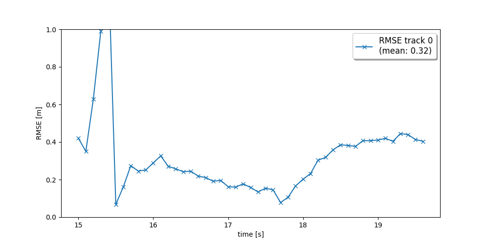
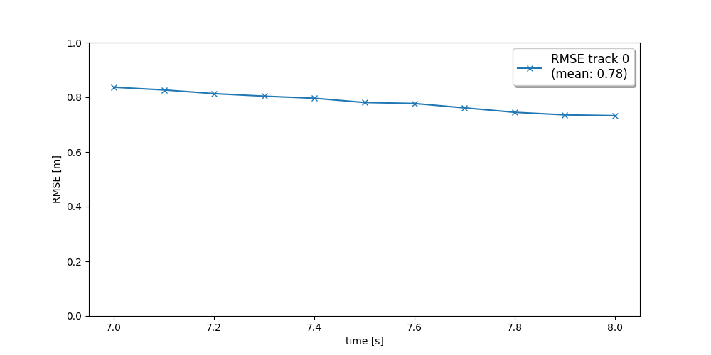
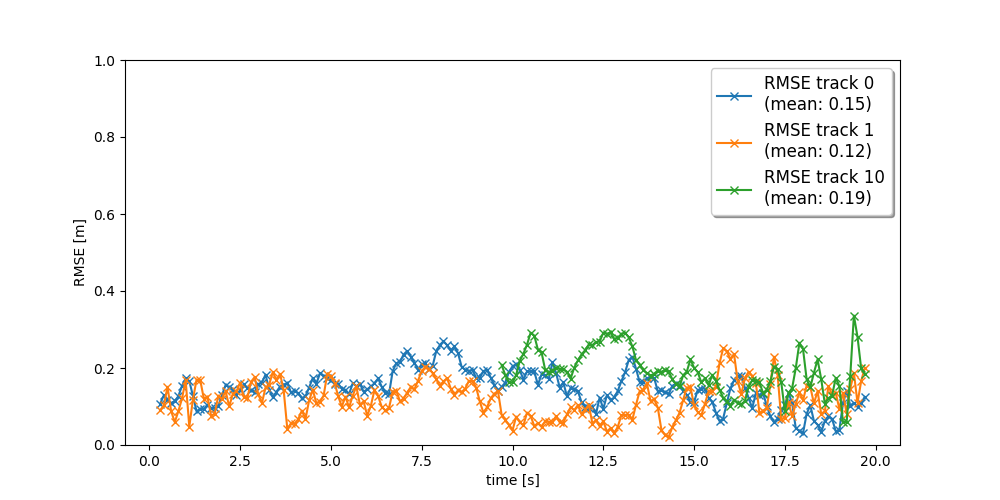
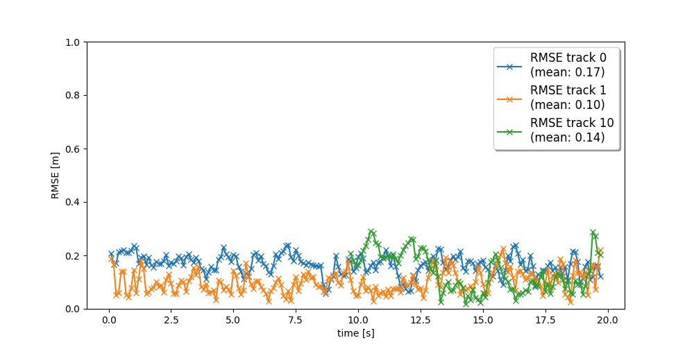

# Track 3D-Objects Over Time

### 1. Projects Results

#### Step 1：

#### step 2：

#### Step 3

#### Step 4

These codes are similar to the contents from Andreas in the class. But the logical relationship is some complex.  I know clearly that Multi-Target Tracking takes place in vehicle coordinate, but I confused about the coordinate transform in this project. At last, I found when computing the H Matrix of KF, the transformation is considered. But I have not figured out the process of the camera H in the codes. 

### 2.  Benefits in Sensor Fusion

In Sensor Fusion, by combining the the lidar's high resolution position information with camera's ability to classify and its pixel position of objects, we can gain more accurate result about position and the size of 3D bounding box. Comparing to the RMSE results of step 3 and step 4, we can see that RMSE is lower with combining the camera results in step 4.

### 3. Challenges in Sensor Fusion System

Every sensor has its own coordinate system and frequency. I think the challenges in Sensor Fusion System are time synchronization and sensor calibration. In the project, the calibration matrix is given and time is aligned.

### 4. Ways to Improve Tracking Results

* Fine tuning the parameters in `param.py` such `confirmed_threshold`,`delete_threshold`  and so on.
* Use more advanced data association, e.g. Global Nearest Neighbor (GNN) or Joint Probabilistic Data Association (JPDA).
* Use a non-linear motion model, e.g. a bicycle model which is appropriate for vehicle movement in real life.

