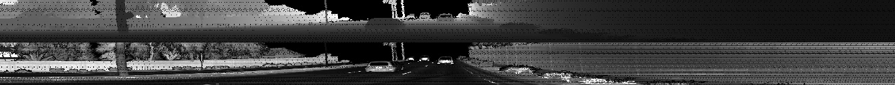
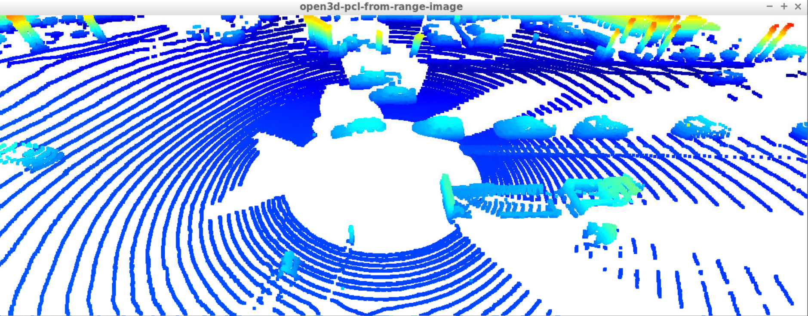
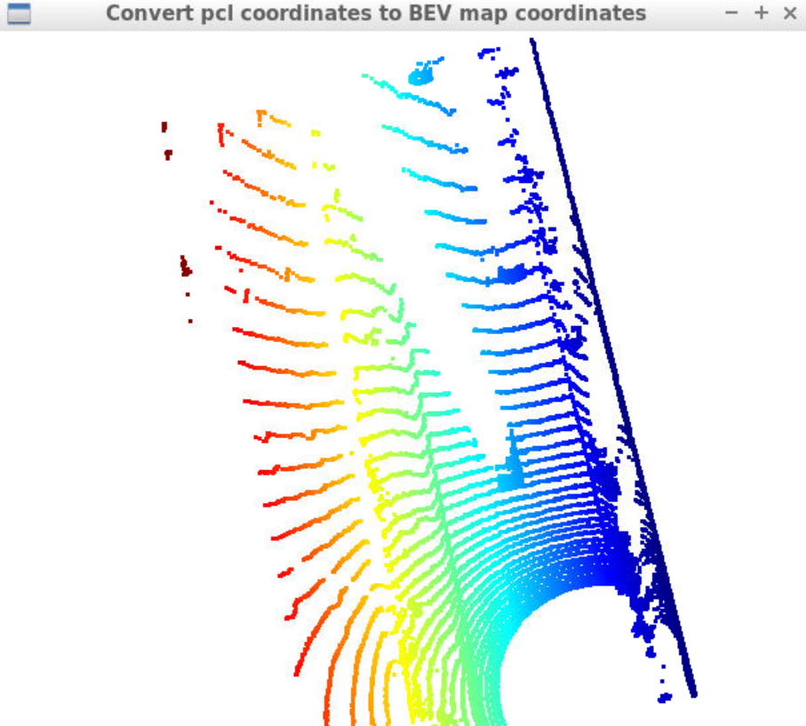
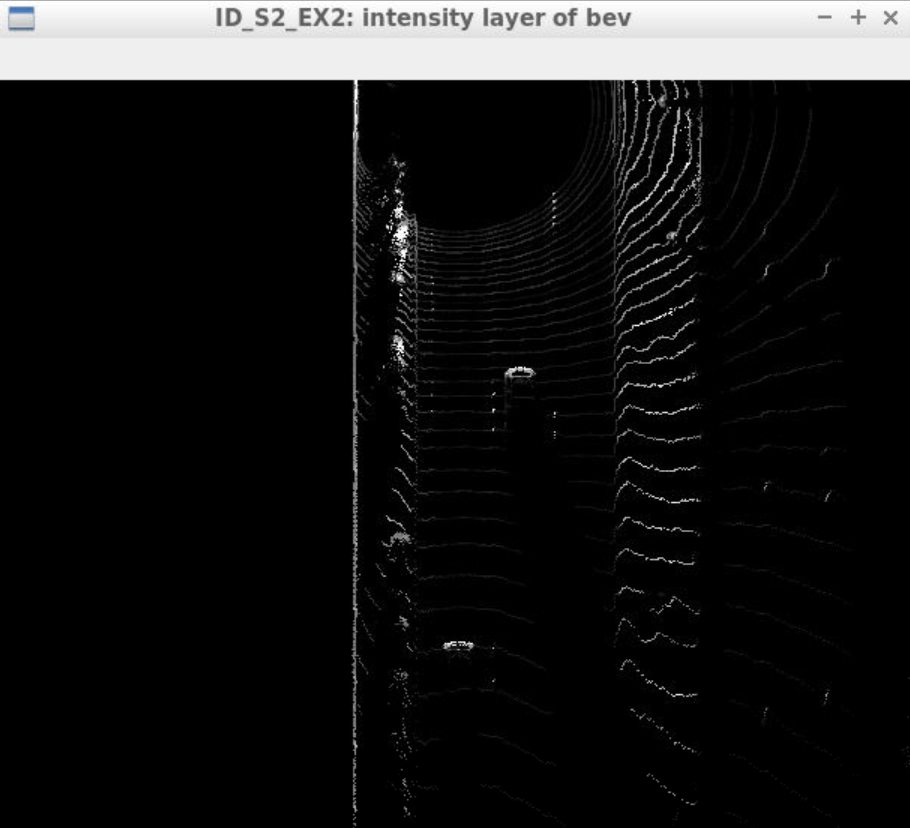
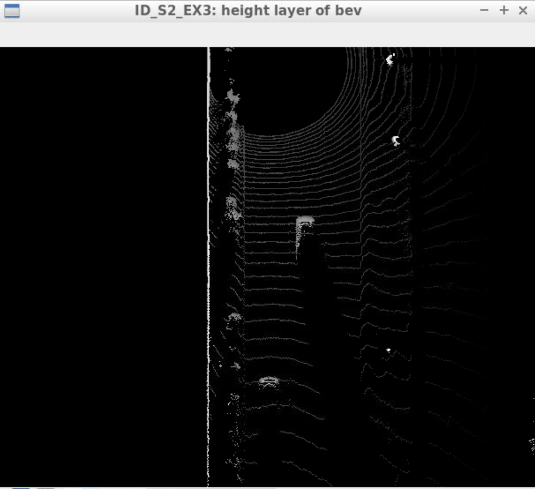
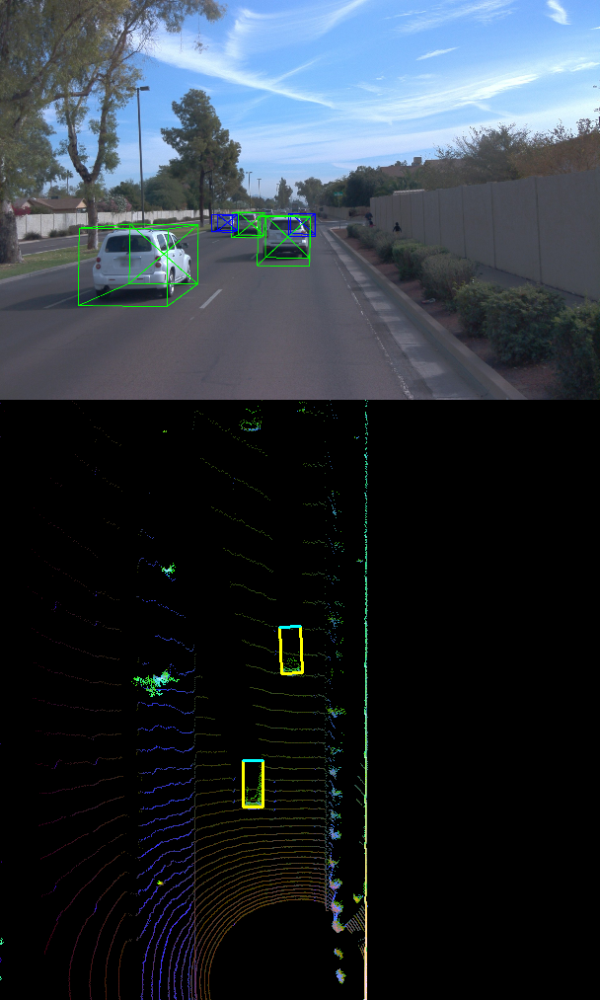
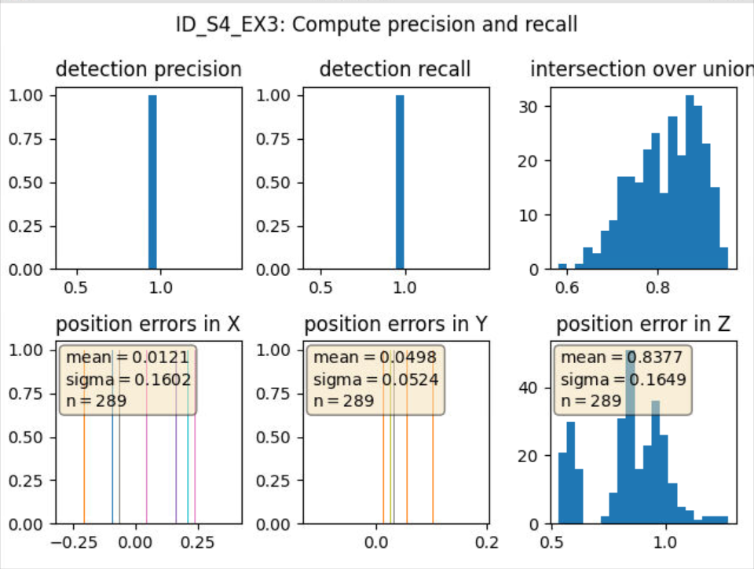
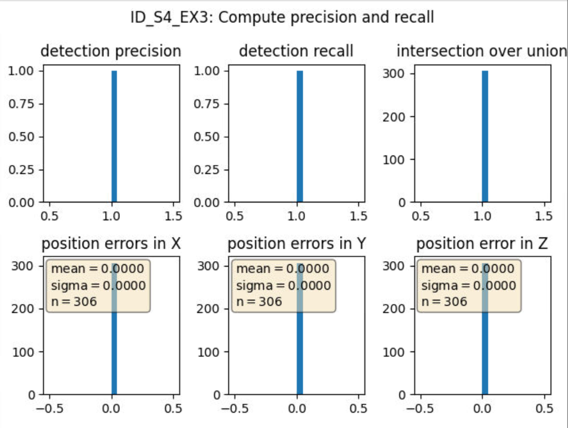

## Mid-Term Project: 3D Object Detection

## Section 1 :Compute Lidar Point-Cloud from Range Image

##### Visualize range image channels (ID_S1_EX1)

##### visualize lidar point-cloud (ID_S1_EX2)



The features of vehicles in lidar point cloud as follows:

* Directly in front of the vehicle, there is a large gap in perception ("blind spot") due to the occlusion of the laser beam by the vehicle.
*  Because of lidar's significantly smaller beam divergence, it can detect some small features of vehicles, such as the bumpers, wheels and so on.
* The metal surface of vehicle has higher reflectivity than its glass window, because you can find that there are a small number of points points on the windows.
* The nearer the vehicle is to the lidar, the more points on its surface. Because the gap between adjacent beams is widening with distance due to the fixed angle in which laser diodes are positioned vertically

## Section 2 : Create Birds-Eye View from Lidar PCL

##### Convert sensor coordinates to BEV-map coordinates (ID_S2_EX1)

<div align=center> </div>

##### Compute intensity layer of the BEV map (ID_S2_EX2) 

<div align=center> </div>

##### Compute height layer of the BEV map (ID_S2_EX3)

<div align=center> </div>

### Section 3 : Model-based Object Detection in BEV Image

##### Extract 3D bounding boxes from model response (ID_S3_EX2)

<div align=center> </div>

### Section 4 : Performance Evaluation for Object Detection

##### Compute precision and recall (ID_S4_EX3)

```python
# student task ID_S4_EX3
# True = use groundtruth labels as objects, False = use model-based detection
configs_det.use_labels_as_objects = False
precision = 0.9262820512820513, recall = 0.9444444444444444
```

<div align=center> </div>

```python
# student task ID_S4_EX3
# True = use groundtruth labels as objects, False = use model-based detection
configs_det.use_labels_as_objects = True 
precision = 1.0, recall = 1.0
```

<div align=center> </div>

